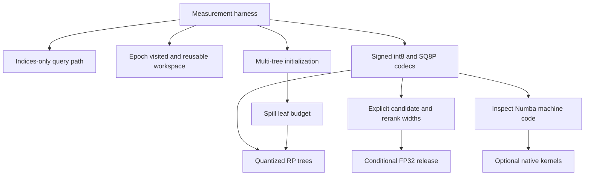

# PyNNDescent Optimization Port Plan

## Objective

Create an evidence-controlled catalogue of the production query improvements developed in `pynndescent_rs`, compare them with current `lmcinnes/pynndescent` master, and turn the genuinely missing and portable mechanisms into a prioritized Python/Numba optimization backlog.

The work must distinguish:

- Verified query-QPS improvements.
- Recall improvements and recall/QPS policy choices.
- Storage and cache-footprint improvements.
- Baseline architecture that was retained but not independently benchmarked.
- ANN-Benchmarks configuration tuning rather than implementation changes.
- Experiments that were rejected and should not be repeated.

Gains from separately measured experiments must not be added together. Measurements affected by allocation or execution order must be labelled directional rather than promotion-grade.

## Scope and evidence rules

The primary workload is GloVe-100-angular under ANN-Benchmarks, with emphasis on single-query recall/QPS. Construction time and storage are included only where they enable or materially affect query performance.

Use the evidence grades established in [OPTIMIZATION_AUDIT.md](OPTIMIZATION_AUDIT.md):

- **A — promotion-grade:** same index/allocation, fixed graph, alternating balanced blocks, controlled CPU placement, and confidence intervals.
- **B — strong directional evidence:** fixed graph and repeated full-query timing, but configurations were sequential or separately allocated.
- **C — exploratory:** short runs, incomplete sweeps, microbenchmarks, historical profiling, or order-sensitive results.

A proposed optimization should normally demonstrate at least a repeated 3% end-to-end single-query QPS improvement at matched recall. A smaller QPS improvement may be retained when it provides a compelling independently measured storage benefit with acceptable recall.

The known measurement confound is important: early graph-layout gains of 5–11% fell to roughly 2–3% under balanced scheduling, while separately allocated tree-routing comparisons reported 12–35% gains that fell to approximately 0–4% in same-index blocked measurements. Small claims require balanced same-index evidence.

# Phase 1 — Evidence-controlled Rust catalogue

## 1. Catalogue the production query path

Document each retained mechanism with:

1. What changed or what production behavior it establishes.
2. Current implementation symbols and files.
3. Effect category: QPS, recall, storage/cache, construction, or API overhead.
4. Evidence grade and measured range, where available.
5. Caveats and interactions with other mechanisms.
6. Whether it is already present in Python master.

The catalogue should cover the following mechanisms.

### 1.1 CSR graph and heap-based epsilon traversal

Reference:

- [crates/nndescent-core/src/graph/search_graph.rs](crates/nndescent-core/src/graph/search_graph.rs)
- [crates/nndescent-core/src/heap/candidate_heap.rs](crates/nndescent-core/src/heap/candidate_heap.rs)
- [crates/nndescent-core/src/search/greedy.rs](crates/nndescent-core/src/search/greedy.rs)

Describe:

- CSR adjacency storage.
- A bounded max-heap for retained results.
- A min-heap for candidate expansion.
- Epsilon-scaled stopping bounds.
- Candidate insertion only when the current bound can improve.

Evidence:

- This is the retained production baseline, not a cleanly isolated improvement over Python.
- The rejected linear candidate pool was 5.5–33.8% slower across the tested recall range, confirming that heap traversal should remain the design.

### 1.2 Reusable query workspace

Reference:

- `SearchWorkspace` in [crates/nndescent-core/src/search/greedy.rs](crates/nndescent-core/src/search/greedy.rs)
- `CandidateHeap` and `BoundedHeap` in [crates/nndescent-core/src/heap/candidate_heap.rs](crates/nndescent-core/src/heap/candidate_heap.rs)

Describe reuse of:

- Result heap.
- Candidate heap.
- Tree frontier.
- Tree-leaf scratch storage.
- Visited state.

Do not claim an isolated QPS percentage; no promotion-grade end-to-end result isolates workspace reuse.

### 1.3 Epoch-stamped visited state

Reference:

- `VisitedSet` in [crates/nndescent-core/src/visited.rs](crates/nndescent-core/src/visited.rs)

Describe:

- A `u16` epoch per vertex.
- Constant-time logical clearing by incrementing the current epoch.
- Full clearing only on epoch overflow.
- Combined `check_and_mark()` in the traversal hot path.

This is a strong candidate for Python/Numba evaluation because Python master currently clears a visited bitset for every query. It needs an isolated benchmark because the epoch array uses more memory than the bitset.

### 1.4 RP-tree query initialization

Reference:

- `initialize_fp32()` and `initialize_quantized()` in [crates/nndescent-core/src/search/greedy.rs](crates/nndescent-core/src/search/greedy.rs)
- `FlatTree::search_leaves()` and `QuantizedFlatTree::search_leaves()` in [crates/nndescent-core/src/tree/flat_tree.rs](crates/nndescent-core/src/tree/flat_tree.rs)

Describe:

- Query routing through retained RP trees.
- Multiple retained search trees.
- Spill search with an explicit leaf budget.
- Seeding the result and candidate heaps with all distinct points from selected leaves.
- Random seeds only when tree initialization provides fewer than the required initial candidates.

Evidence:

- RP-tree initialization improved matched-recall QPS by 18.5% near recall 0.55, 11.4–12.1% near recall 0.70–0.80, and 7.7% near recall 0.86 versus fixed entry.
- Evidence grade B: the graph was controlled, but this was not a balanced same-index experiment.
- It evaluated about 18 hyperplanes and 17 leaf vectors while avoiding roughly 140–175 downstream vector evaluations.

### 1.5 Physical tree-order remapping

Reference:

- Vertex ordering and original-ID mapping in [crates/nndescent-core/src/index.rs](crates/nndescent-core/src/index.rs)

Describe:

- Data, graph vertices, and retained tree leaf IDs are remapped into the first tree's leaf order.
- Query results are mapped back to original input IDs.
- The intended effect is improved locality between initialization leaves, vector rows, and graph rows.

No isolated balanced comparison proves the gain. Treat this as retained production behavior rather than a quantified improvement. Current Python master already performs equivalent tree-order remapping.

### 1.6 Normalized direct-cosine path

Reference:

- `normalize_rows_inplace()` and `cosine_distance_mode="direct"` in [crates/pynndescent-rs/src/lib.rs](crates/pynndescent-rs/src/lib.rs)
- Direct normalized distance code in [crates/nndescent-core/src/distance/alternatives.rs](crates/nndescent-core/src/distance/alternatives.rs)

Describe:

- Normalize index vectors once.
- Normalize each query once.
- Compute cosine distance from a single dot product instead of recomputing both vector norms.

Do not assign an isolated percentage. Python master already exposes a normalized `dot` path and ANN-Benchmarks maps angular queries to it.

### 1.7 Runtime SIMD kernels

Reference:

- [crates/nndescent-core/src/distance/euclidean.rs](crates/nndescent-core/src/distance/euclidean.rs)
- [crates/nndescent-core/src/distance/cosine.rs](crates/nndescent-core/src/distance/cosine.rs)
- [crates/nndescent-core/src/distance/inner_product.rs](crates/nndescent-core/src/distance/inner_product.rs)
- [crates/nndescent-core/src/distance/alternatives.rs](crates/nndescent-core/src/distance/alternatives.rs)
- [crates/nndescent-core/src/distance/quantized.rs](crates/nndescent-core/src/distance/quantized.rs)

Describe:

- Runtime AVX2/FMA detection with scalar fallbacks.
- Specialized FP32 dot, cosine, Euclidean, and related kernels.
- Signed-int8 integer dot products.

SIMD is production infrastructure but lacks an isolated end-to-end ANN-Benchmarks gain. Python already uses Numba `fastmath`; any porting work should inspect generated LLVM/assembly before assuming that rewriting loops helps.

### 1.8 Signed-int8 vector representation

Reference:

- Quantized ownership and encoding in [crates/pynndescent-rs/src/lib.rs](crates/pynndescent-rs/src/lib.rs)
- `quantized_i8_dot()` in [crates/nndescent-core/src/distance/quantized.rs](crates/nndescent-core/src/distance/quantized.rs)
- Quantized traversal in [crates/nndescent-core/src/search/greedy.rs](crates/nndescent-core/src/search/greedy.rs)

Describe:

- Per-vector signed-int8 cosine codes.
- Per-vector inverse-norm metadata.
- Approximately 104 bytes per vector at dimension 100 versus 400 bytes for FP32 vectors.
- Signed integer dot accumulation followed by scale/norm correction.

Evidence:

- Historical sequential tests suggested 25–28% matched-recall QPS gains, but these are not promotion-grade because indexes were separately allocated and sequentially timed.
- Full 10,000-query no-rerank runs lost only about 0.14–0.64 recall percentage points versus direct FP32 over epsilon 0.04–0.16.
- Retain primarily because of storage and acceptable recall; do not promise a 25–28% speedup.

### 1.9 SQ8U and SQ8P representations

Reference:

- Quantized encoding modes in [crates/pynndescent-rs/src/lib.rs](crates/pynndescent-rs/src/lib.rs)

Describe:

- SQ8U global symmetric quantization.
- SQ8P per-vector symmetric quantization.
- SQ8P's approximately 104-byte/vector target at dimension 100.

Evidence and policy:

- Historical SQ8U and SQ8P QPS measurements are directional, not promotion-grade.
- SQ8P no-rerank recall loss stayed below about 0.76 percentage points through epsilon 0.16 in the full run.
- SQ8U remains useful as a compact proxy, but quantized RP-tree routing was neutral to 1.8% slower and less faithful.
- Do not port SQ8U quantized-tree routing without contrary new evidence.

### 1.10 Candidate width and exact FP32 reranking

Reference:

- Width resolution and `rerank_quantized_candidates()` in [crates/nndescent-core/src/index.rs](crates/nndescent-core/src/index.rs)
- `quantized_candidate_width` and `quantized_rerank_width` in [crates/pynndescent-rs/src/lib.rs](crates/pynndescent-rs/src/lib.rs)

Describe:

- Approximate traversal width is independent of output `k`.
- Exact rerank width is independent of approximate candidate width.
- Quantized traversal can produce a wider finalist set and rerank only a chosen prefix using FP32 vectors.

Evidence:

- At candidate width 64, reranking 32 candidates recovered approximately 0.70–1.39 recall points for int8 and 0.78–1.56 points for SQ8P in the 1,000-query sweep.
- SQ8P reranking generally cost roughly 1–2% QPS at fixed candidate width; candidate expansion dominated the cost.
- Evidence grade B/C.

Python master already has proxy search and exact reranking through `proxy_beam_size`. The likely port is explicit absolute candidate and rerank widths, not a new reranking framework.

### 1.11 Quantized RP-tree routing

Reference:

- `QuantizedFlatTree` in [crates/nndescent-core/src/tree/flat_tree.rs](crates/nndescent-core/src/tree/flat_tree.rs)
- `initialize_quantized()` in [crates/nndescent-core/src/search/greedy.rs](crates/nndescent-core/src/search/greedy.rs)

Describe:

- Signed-int8 hyperplane storage.
- Quantized query/hyperplane margin calculation.
- Unchanged tree topology and leaves.
- Release of FP32 hyperplanes after conversion.

Evidence:

- Signed-int8 routing improved QPS by approximately 1.34–3.77% across tested epsilon values.
- SQ8P routing improved QPS by approximately 1.07–3.71%.
- Recall changes were negligible.
- Evidence grade A from balanced same-index blocked measurements.

### 1.12 Pure quantized ownership and FP32 release

Reference:

- Quantized index ownership and `storage_info()` in [crates/pynndescent-rs/src/lib.rs](crates/pynndescent-rs/src/lib.rs)

Describe:

- FP32 vectors are released only when exact reranking is disabled.
- FP32 RP-tree hyperplanes are released when owned quantized trees replace them.
- Query-time reranking is rejected clearly if construction released FP32 vectors.

Measured GloVe-100 storage outcome:

- Approximately 104 bytes/vector for codes and metadata.
- Approximately 13.12 bytes/vector for quantized tree storage.
- Approximately 120 bytes/vector for retained neighbor distances.
- Approximately 237.12 accounted bytes/vector, excluding graph IDs and container overhead.
- About 473 MB of FP32 vectors and 31 MB of FP32 trees released.

This is primarily a storage/cache-footprint feature rather than a separately proven QPS gain.

### 1.13 Indices-only single-query API

Reference:

- `query_one_indices_with_workspace()` in [crates/nndescent-core/src/index.rs](crates/nndescent-core/src/index.rs)
- `query_one_indices()` in [crates/pynndescent-rs/src/lib.rs](crates/pynndescent-rs/src/lib.rs)
- Usage in [ann-benchmarks/ann_benchmarks/algorithms/pynndescent_rs/module.py](ann-benchmarks/ann_benchmarks/algorithms/pynndescent_rs/module.py)

Describe avoided work:

- No parallel distance-output vector.
- No distance correction when ANN-Benchmarks needs only IDs.
- No batch-shaped result for a single query.

No isolated percentage is available. This is a low-risk Python port candidate.

### 1.14 GIL release and batch parallelism

Reference:

- `py.allow_threads()` calls in [crates/pynndescent-rs/src/lib.rs](crates/pynndescent-rs/src/lib.rs)
- Rayon paths in [crates/nndescent-core/src/index.rs](crates/nndescent-core/src/index.rs)

Describe:

- Rust query execution proceeds without holding the Python GIL.
- Batch queries can be distributed across Rayon workers.
- Single-query ANN-Benchmarks remains serial by design.

Python master already supports Numba parallel batch queries. Do not conflate batch throughput with single-query QPS.

### 1.15 Fixed vector-prefetch lookahead

Reference:

- `PREFETCH_LOOKAHEAD` and `prefetch()` in [crates/nndescent-core/src/search/greedy.rs](crates/nndescent-core/src/search/greedy.rs)

Describe prefetching of upcoming vector rows while scanning a CSR neighbor list. Do not assign an isolated gain. Inserted-adjacency prefetch and configurable prefetch experiments failed and were removed; this fixed vector lookahead is retained production behavior only.

## 2. Catalogue configuration-quality improvements

Add a separate section explaining that the improved ANN-Benchmarks Pareto frontier also came from better parameter policy, not solely faster code.

Use the current sweep in [ann-benchmarks/ann_benchmarks/algorithms/pynndescent_rs/config.yml](ann-benchmarks/ann_benchmarks/algorithms/pynndescent_rs/config.yml) as the source of truth at report-writing time, because it may continue to change.

Cover:

- `n_neighbors`: graph size and recall capacity.
- `pruning_degree_multiplier`: retained graph degree and traversal work.
- `diversify_prob`: redundancy versus connectivity.
- `n_trees`: construction quality.
- `n_search_trees`: initialization breadth.
- `search_tree_leaf_budget`: spill-search breadth.
- `quantized_candidate_width`: approximate search capacity.
- `quantized_rerank_width`: exact finalist refinement.
- `epsilon`: query expansion.

Explain the intended policy:

- Low/mid-recall quantized configurations use zero exact-rerank width so FP32 vectors and quantized-tree replacements can be released.
- High-recall, large-graph int8/SQ8P configurations retain FP32 vectors and rerank a wider approximate finalist set.
- Direct FP32 configurations remain the exact baseline.

Do not present graph-size or epsilon sweeps as implementation speedups. They are operating points on the recall/QPS frontier.

## 3. Record rejected experiments

Include a table with the experiment, result, and recommendation.

| Experiment | Result | Recommendation |
|---|---|---|
| Linear candidate pool | 5.5–33.8% slower than heap traversal | Do not port |
| Two-stage buffering | Approximately neutral and never recovered linear-pool deficit | Do not port |
| Inserted-adjacency prefetch | Generally degraded performance | Do not port |
| Configurable heap prefetch knobs | No durable production win | Do not expose |
| Fixed/padded graph layouts | Roughly 2–3% balanced gain at 3.4–3.7× graph memory | Do not port |
| Fixed-entry initialization | RP-tree initialization was 7.7–18.5% better at matched recall | Do not port |
| HNSW/Glass hierarchy | Generally only 2–5%; complexity exceeded threshold | Do not port as this project |
| SQ8U quantized-tree routing | Neutral to 1.8% slower and less faithful | Keep FP32 routing |
| SQ8D and SQ4U | Incomplete balanced recall/QPS evidence | Do not promote |
| `int8_dual` | Diagnostic-only duplicate storage | Do not port |
| Alternate graph row/order knobs | No isolated promotion-grade result | Keep one production order |
| Trace/profile/statistics APIs | Measurement infrastructure, not runtime optimization | Recreate only in benchmark branches if needed |

# Phase 2 — Current Python master gap analysis

## 4. Baseline

Compare against current `lmcinnes/pynndescent` master, not an older PyPI release or only the local ANN-Benchmarks adapter.

Use upstream module and symbol names in the final report. The installed package under the ANN-Benchmarks virtual environment can be used for inspection, but it is not an implementation target.

## 5. Features already present in Python master

Do not propose these as new ports:

- Numba `fastmath` distance kernels.
- Fast distance alternatives and final correction.
- Normalized `dot` path for angular ANN-Benchmarks.
- CSR search graph.
- Heap-based epsilon traversal.
- Bitset visited tracking.
- RP-tree and graph-informed hub-tree initialization.
- Tree-order remapping of data and graph vertices.
- Compressed indexes.
- Binary, uint8, and uint4 proxy quantization.
- Proxy candidate expansion through `proxy_beam_size`.
- Exact reranking against retained FP32 vectors.
- Parallel batch-query support.
- Standard graph-quality controls.
- Custom Numba-compiled distance callables.

Relevant upstream targets:

- `pynndescent/pynndescent_.py`
- `pynndescent/rp_trees.py`
- `pynndescent/distances.py`
- `pynndescent/utils.py`

## 6. Gap matrix

Build the final report around this initial matrix, validating each entry against current master before implementation.

| Rust mechanism | Python master status | Port decision |
|---|---|---|
| CSR + heap + epsilon bound | Already present | No port |
| Fast distance alternatives | Already present | No port |
| Direct normalized dot | Already present | Ensure adapter uses it |
| Tree-order physical remapping | Already present | No port |
| Graph-informed hub tree | Already present | Do not replace with rejected hierarchy work |
| Reusable result/candidate workspace | Partial/absent | Benchmark a Numba-compatible design |
| Epoch-stamped visited state | Absent | High-priority experiment |
| Multiple search trees during each query | Partial; dense closure uses the first tree | High-priority port |
| Spill/leaf-budget tree search | Absent or incomplete | High-priority port |
| Indices-only single-query API | Absent | High-priority port |
| Avoided single-query temporaries | Partial | Profile and simplify |
| Signed per-vector int8 cosine | Absent | Quantized-search port candidate |
| SQ8P | Absent | Quantized-search port candidate |
| Explicit candidate and rerank widths | Partial through `proxy_beam_size` | Refine existing proxy API |
| Conditional FP32 release | Partial through compression, not tied to rerank policy | Port after quantized path |
| Quantized RP-tree hyperplanes | Absent | Port only after vector quantization succeeds |
| Runtime intrinsic dispatch | Numba handles code generation differently | Inspect generated code; do not directly port |
| Software prefetch | No pure-Python equivalent | Native-only experiment at most |
| GIL release | Numba query kernels normally execute native code | Verify rather than redesign |

# Phase 3 — Prioritized Python/Numba backlog

## Priority 0 — Measurement infrastructure

Before porting code, build a benchmark capable of rejecting false small gains.

### P0.1 Same-graph blocked query benchmark

Requirements:

- Use one prepared Python index and one fixed graph where possible.
- Run baseline and candidate implementations in alternating balanced blocks.
- Pin CPU affinity where available.
- Restrict BLAS/OpenMP/Numba thread counts explicitly.
- Warm JIT compilation before timing.
- Separate index build, preparation, encoding, and query time.
- Report single-query and batch-query performance separately.

Metrics:

- Recall@k.
- QPS and latency distribution.
- Bootstrap confidence interval for paired QPS difference.
- Result overlap.
- Distance evaluations.
- RP-tree hyperplane and seed-vector evaluations.
- Candidate pushes/pops if instrumentation overhead can be isolated.
- Temporary allocations or bytes allocated per query.
- Retained index memory.

Acceptance rule:

- Promote a query optimization only after a repeated improvement of at least 3% at matched recall, unless it independently provides substantial storage reduction.

## Priority 1 — Low-risk query-path work

### P1.1 Indices-only single-query API

Target:

- `NNDescent.query()` and the compiled dense/sparse query closures in `pynndescent/pynndescent_.py`.
- [ann-benchmarks/ann_benchmarks/algorithms/pynndescent/module.py](ann-benchmarks/ann_benchmarks/algorithms/pynndescent/module.py).

Design:

- Add a path returning only IDs.
- Avoid allocating and sorting a distance result that the caller discards where possible.
- Avoid distance correction.
- Avoid a batch-shaped output for one query.
- Preserve the existing full `query()` API.

Acceptance criteria:

- Identical IDs to the full query path for deterministic inputs.
- At least 3% single-query ANN-Benchmarks improvement, or remove the extra API if the gain is negligible.
- No change to batch behavior.

### P1.2 Epoch-stamped visited IDs

Target:

- Dense query closure in `pynndescent/pynndescent_.py`.
- A utility implementation in `pynndescent/utils.py` if shared.

Design:

- Replace per-query clearing of the entire visited bitset with an integer epoch array and current epoch.
- Use a combined check-and-mark operation.
- Handle overflow by clearing the epoch array and restarting at one.
- Evaluate `uint16` versus `uint32` epochs based on memory and overflow frequency.

Acceptance criteria:

- Identical traversal decisions and results.
- Memory impact documented relative to the current bitset.
- At least 3% QPS improvement on large indexes, or reject because the larger random-access footprint outweighs clear-time savings.
- Separate results for streaming single queries and parallel batches.

### P1.3 Reusable query buffers

Target:

- Compiled search closure and wrapper in `pynndescent/pynndescent_.py`.

Design candidates:

- Reuse result heap arrays when `k` is unchanged.
- Reuse candidate-heap storage where Numba permits.
- Reuse tree frontier and selected-leaf buffers.
- Keep per-worker workspaces for parallel batch queries to avoid races.

Acceptance criteria:

- No state leakage between queries.
- Deterministic repeated results.
- Allocation reduction measured directly.
- At least 3% end-to-end QPS improvement; otherwise retain only the simplest safe changes.

### P1.4 True multi-tree initialization

Target:

- Search-forest preparation and dense/sparse search closures in `pynndescent/pynndescent_.py`.
- Tree-search helpers in `pynndescent/rp_trees.py`.

Current gap:

- Python master can retain/configure multiple search trees, but the dense closure captures and searches the first tree for each query.

Design:

- Store the configured set of flattened search trees.
- Route each query through all selected trees.
- Deduplicate leaf candidates through visited state.
- Seed result and candidate heaps from every selected leaf.
- Fill with random candidates only when needed.

Acceptance criteria:

- Sweep one, two, and possibly four trees.
- Compare at matched recall, not fixed epsilon alone.
- Track seed-vector and downstream graph-distance evaluations.
- Promote only operating points that improve the Pareto frontier.

### P1.5 Spill search and explicit leaf budget

Target:

- `pynndescent/rp_trees.py` tree-search helpers.
- `NNDescent` constructor and query closure.

Design:

- Maintain a frontier of alternate branches ranked by hyperplane-margin distance.
- Visit up to `search_tree_leaf_budget` leaves per tree.
- Return leaf ranges without per-query Python object allocation.
- Combine with multi-tree initialization while retaining independent controls.

Acceptance criteria:

- Sweep budgets 1, 2, and 3 or another evidence-based small set.
- Report recall/QPS and evaluation counts.
- Verify that budget 1 reproduces current one-leaf behavior.
- Promote only if the matched-recall frontier improves.

### P1.6 Reduce single-query normalization and wrapper allocation

Target:

- `NNDescent.query()` in `pynndescent/pynndescent_.py`.
- Python ANN-Benchmarks adapter.

Investigate:

- Repeated `np.asarray(...).astype(..., order="C")` calls.
- Reshaping one query into a batch.
- Per-query normalized-array allocation.
- Result remapping and correction when only IDs are needed.
- Whether a pre-normalized-query API is worthwhile for benchmarks and streaming users.

Acceptance criteria:

- Preserve existing semantics for arbitrary user input.
- Optional fast path may require contiguous FP32 input.
- Measure wrapper time separately from compiled traversal.
- Do not complicate the API for a sub-threshold gain.

## Priority 2 — Quantized search family

Reuse Python master’s existing proxy-distance and reranking architecture rather than creating a second unrelated query framework.

### P2.1 Signed per-vector int8 codec

Target:

- New or existing quantized-distance section in `pynndescent/distances.py`.
- Preparation and dispatch in `pynndescent/pynndescent_.py`.

Design:

- Normalize cosine data consistently.
- Encode each vector to signed int8 using a per-vector scale.
- Store inverse norm or equivalent scale metadata.
- Quantize each query once.
- Accumulate products into at least 32-bit integers.
- Convert the similarity to a bounded cosine distance.

Before implementation claims:

- Inspect Numba LLVM and generated assembly for widening and vectorization.
- Microbenchmark dimensions representative of ANN-Benchmarks, especially 100 and 128.
- Compare against existing uint8 proxy kernels and direct normalized dot.

Acceptance criteria:

- Encoding and query-distance correctness tests.
- Full recall/QPS sweep.
- Memory accounting.
- No large QPS claim unless balanced tests support it.
- Retain if storage is compelling and recall remains acceptable even when QPS gain is below 3%.

### P2.2 SQ8P codec

Implement per-vector symmetric quantization as a sibling to signed-int8 cosine, sharing infrastructure where possible.

Acceptance criteria:

- Compare signed int8 and SQ8P on the same index/graph schedule.
- No-rerank recall loss target informed by Rust: below roughly one percentage point in the tested range.
- Avoid duplicate APIs if one codec dominates.

### P2.3 Explicit candidate and rerank widths

Target:

- `NNDescent.query()` proxy-search policy.

Design:

- Replace or supplement multiplicative `proxy_beam_size` with explicit `candidate_width` and `rerank_width`.
- Require `candidate_width >= k`.
- Require `rerank_width <= candidate_width` and either zero or at least `k`.
- Search approximately with `candidate_width`.
- Re-evaluate only `rerank_width` finalists exactly.
- Return top `k`.

Acceptance criteria:

- Backward-compatible mapping from `proxy_beam_size` where practical.
- Width sweeps at fixed quantizer and graph.
- Verify that rerank cost is measured independently from candidate expansion.

### P2.4 Conditional FP32 retention/release

Design:

- If exact reranking is disabled at index preparation, permit release of FP32 vectors after all FP32-dependent search structures are built.
- If reranking is enabled, retain FP32 vectors.
- Reject attempts to request exact reranking after FP32 release.
- Preserve serialization and compressed-index semantics.

Acceptance criteria:

- Explicit ownership tests.
- Storage accounting before and after release.
- Identical no-rerank results with and without an otherwise unused FP32 copy.
- Update behavior documented or disabled for pure quantized indexes if reconstruction is impossible.

### P2.5 Quantized RP-tree routing

Dependency:

- Do not begin until P2.1/P2.2 pass correctness and recall/QPS gates.

Target:

- Flattened tree representation and search helpers in `pynndescent/rp_trees.py`.

Design:

- Quantize hyperplanes with explicit per-tree or per-node scaling based on measured tradeoffs.
- Preserve FP32 offsets, topology, children, and leaf IDs.
- Route quantized queries with integer dot products and scale correction.
- Release FP32 hyperplanes only after conversion.

Acceptance criteria:

- Same-index blocked comparison against FP32 tree routing.
- Result overlap and recall deltas.
- Tree-memory accounting.
- Target the Rust result range of approximately 1–4% QPS plus storage reduction, but do not assume it will transfer to Numba.
- Do not implement SQ8U quantized routing unless new evidence justifies it.

## Priority 3 — Native-only or conditional work

### P3.1 Inspect generated machine code

Before adding native dependencies:

- Inspect Numba LLVM/assembly for direct dot, signed-int8 dot, and tree-margin kernels.
- Check widening operations, vector width, horizontal reductions, bounds checks, and alignment assumptions.
- Benchmark cold and warm execution separately.

### P3.2 Optional small native kernel extension

Consider only if Numba cannot produce competitive integer code.

Possible scope:

- Signed-int8 dot product.
- Direct normalized FP32 dot product.
- Quantized tree-margin kernel.

Avoid moving graph traversal into the extension unless the project explicitly chooses a hybrid native backend; that would cease to be a small port to original Python PyNNDescent.

### P3.3 Software prefetch

Do not attempt a pure-Python prefetch API. A native kernel may test fixed upcoming-vector prefetch only if hardware counters show a memory-latency bottleneck. Do not restore the rejected configurable or inserted-adjacency prefetch designs.

# Phase 4 — Validation and promotion

## 7. Correctness matrix

Test each applicable optimization across:

- Dense cosine/dot.
- Dense Euclidean where relevant.
- Sparse paths only when explicitly supported.
- Small and large datasets.
- `k` values representative of ANN-Benchmarks.
- Single-query and batch modes.
- Compressed and uncompressed indexes.
- Serialization round trips.
- Index updates where the feature claims update support.

## 8. Performance protocol

For each candidate:

1. Warm JIT and caches consistently.
2. Use the same graph and query set.
3. Alternate baseline and candidate in balanced blocks.
4. Pin CPU affinity where practical.
5. Fix thread counts.
6. Report medians and confidence intervals.
7. Compare at matched recall.
8. Keep query, encoding, preparation, and construction time separate.
9. Record memory and evaluation counts.

## 9. Rollback gates

Reject or revert an optimization when:

- It does not repeatedly clear the 3% matched-recall QPS gate and has no compelling storage benefit.
- It increases memory disproportionately to a small gain.
- It creates a large public option surface without distinct useful operating points.
- It regresses sparse search, updates, serialization, or compressed indexes outside a clearly documented scope.
- Its benefit vanishes under balanced same-index scheduling.
- It depends on architecture-specific behavior without a safe fallback.

# Recommended execution order

Suggested issue sequence:

1. Build the balanced Python query benchmark and instrumentation.
2. Implement and measure the indices-only path.
3. Measure epoch visited state and reusable buffers independently.
4. Implement true multi-tree query initialization.
5. Add spill search with a small explicit leaf budget.
6. Profile and remove avoidable single-query wrapper allocations.
7. Add signed-int8 and SQ8P proxy codecs using existing rerank infrastructure.
8. Replace implicit proxy beam policy with explicit candidate/rerank widths.
9. Add conditional FP32 release for no-rerank quantized indexes.
10. Add quantized RP-tree routing.
11. Consider native kernels only after inspecting Numba output.

These items can be worked in parallel where dependencies allow, but their separately measured gains must never be summed into a projected total.

# Report deliverable

The eventual optimization report should contain:

1. Executive summary.
2. Evidence methodology and caveats.
3. Rust production-improvement catalogue.
4. ANN-Benchmarks tuning and storage-policy catalogue.
5. Rejected experiment table.
6. Current Python-master capability inventory.
7. Rust-to-Python gap matrix.
8. Prioritized port backlog with acceptance criteria.
9. Recommended execution order.
10. Appendix linking every quantitative claim to source evidence.

# Relevant evidence and source files

- [OPTIMIZATION_AUDIT.md](OPTIMIZATION_AUDIT.md)
- [STAGE5_6_PLAN.md](STAGE5_6_PLAN.md)
- [initializer-comparison-summary.md](initializer-comparison-summary.md)
- [quantization-stage6-summary.md](quantization-stage6-summary.md)
- [quantization-stage6-sq8p-summary.md](quantization-stage6-sq8p-summary.md)
- [quantized-tree-routing-summary.md](quantized-tree-routing-summary.md)
- [hotpath-stage5-summary.md](hotpath-stage5-summary.md)
- [graph-layout-blocked-summary.md](graph-layout-blocked-summary.md)
- [glass-hierarchy-summary.md](glass-hierarchy-summary.md)
- [crates/nndescent-core/src/search/greedy.rs](crates/nndescent-core/src/search/greedy.rs)
- [crates/nndescent-core/src/visited.rs](crates/nndescent-core/src/visited.rs)
- [crates/nndescent-core/src/heap/candidate_heap.rs](crates/nndescent-core/src/heap/candidate_heap.rs)
- [crates/nndescent-core/src/index.rs](crates/nndescent-core/src/index.rs)
- [crates/nndescent-core/src/tree/flat_tree.rs](crates/nndescent-core/src/tree/flat_tree.rs)
- [crates/nndescent-core/src/distance/quantized.rs](crates/nndescent-core/src/distance/quantized.rs)
- [crates/pynndescent-rs/src/lib.rs](crates/pynndescent-rs/src/lib.rs)
- [ann-benchmarks/ann_benchmarks/algorithms/pynndescent_rs/module.py](ann-benchmarks/ann_benchmarks/algorithms/pynndescent_rs/module.py)
- [ann-benchmarks/ann_benchmarks/algorithms/pynndescent_rs/config.yml](ann-benchmarks/ann_benchmarks/algorithms/pynndescent_rs/config.yml)
- [ann-benchmarks/ann_benchmarks/algorithms/pynndescent/module.py](ann-benchmarks/ann_benchmarks/algorithms/pynndescent/module.py)

# Decisions

- The comparison baseline is current `lmcinnes/pynndescent` master.
- Query recall/QPS is the priority; construction and storage are separated unless they enable query behavior.
- Already-present Python features are not presented as ports.
- Rejected Rust experiments remain explicit non-recommendations.
- Small gains require balanced same-index evidence.
- Sequential separately allocated measurements are directional only.
- Storage can independently justify a feature when recall remains acceptable.
- The initial implementation focus is indices-only queries, reusable state, and multi-tree/spill initialization before adding another quantization family.
